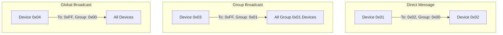

# EventMsg Library

A lightweight event-based messaging protocol library for ESP32 and Arduino platforms. This library provides a reliable communication protocol with features like byte stuffing, message framing, addressing support, and an advanced event dispatcher system.

## Features

- 🔄 Reliable message framing with byte stuffing
- 📫 Modern EventDispatcher system with simplified event handling
- 👥 Group-based message filtering with EventHeader support
- 🔌 Transport layer agnostic (UART, TCP, BLE, etc.)
- 🛡️ Buffer overflow protection
- 🧩 Event-based architecture with full context support
- 📚 Comprehensive documentation

## Installation

### PlatformIO

1. Add dependency to your `platformio.ini`:

```ini
lib_deps = 
    EventMsg
```

### Manual Installation

1. Download this repository
2. Copy it to your Arduino/libraries folder
3. Restart your Arduino IDE

## Quick Start

### Using EventDispatcher

The primary way to handle events is using the EventDispatcher class:

```cpp
#include <EventMsg.h>
#include <EventDispatcher.h>

EventMsg eventMsg;
EventDispatcher mainDispatcher(0x01);  // Initialize with local address

void setup() {
    // Initialize EventMsg
    eventMsg.init([](uint8_t* data, size_t len) {
        return Serial.write(data, len) == len;
    });
    
    // Register event handlers
    mainDispatcher.on("LED_CONTROL", [](const char* data, EventHeader& header) {
        bool state = (data[0] == '1');
        digitalWrite(LED_BUILTIN, state);
        
        // Create response header automatically
        auto responseHeader = mainDispatcher.createResponseHeader(header);
        eventMsg.send("LED_STATUS", state ? "ON" : "OFF", responseHeader);
    });
    
    // Register dispatcher with EventMsg
    eventMsg.registerDispatcher("main", 
                              mainDispatcher.createHeader(0x01), // Direct messages
                              mainDispatcher.getHandler());
}
```

### Using Event Subsystems

Organize code into logical subsystems:

```cpp
// Define a subsystem
struct SensorSubsystem {
    EventDispatcher dispatcher;
    float lastTemp = 25.0f;
    
    SensorSubsystem() : dispatcher(0x01) {  // Set local address
        dispatcher.on("readTemp", [this](const char* data, EventHeader& header) {
            char response[32];
            snprintf(response, sizeof(response), "%.1f", lastTemp);
            
            // Use helper for response header
            auto responseHeader = dispatcher.createResponseHeader(header);
            eventMsg.send("tempData", response, responseHeader);
        });
    }
    
    void registerWithEventMsg() {
        eventMsg.registerDispatcher("sensor",
                                  dispatcher.createHeader(0x01),  // Listen on address 0x01
                                  dispatcher.getHandler());
    }
};
```

### Event Header Structure

Messages use the EventHeader struct for routing:

```cpp
struct EventHeader {
    uint8_t senderId;    // Source device address
    uint8_t receiverId;  // Destination address (0xFF for broadcast)
    uint8_t groupId;     // Group address (0x00 for no group)
    uint8_t flags;       // Message flags
};
```

### Addressing and Message Routing

The EventMsg library supports flexible addressing:



#### Create Headers for Different Routing:

```cpp
// Direct message to device 0x02
auto directHeader = dispatcher.createHeader(0x02);

// Message to all devices in group 0x01
auto groupHeader = dispatcher.createHeader(0xFF, 0x01);

// Broadcast to all devices
auto broadcastHeader = dispatcher.createHeader(0xFF);

// Create response header from received message
auto responseHeader = dispatcher.createResponseHeader(receivedHeader);
```

### Multiple Dispatchers Example

Handle different types of messages with separate dispatchers:

```cpp
// Create dispatchers for different subsystems
EventDispatcher fileDispatcher(0x01);    // File operations
EventDispatcher sensorDispatcher(0x01);  // Sensor handling
EventDispatcher networkDispatcher(0x01); // Network operations

// Set up handlers
fileDispatcher.on("deleteFile", [](const char* data, EventHeader& header) {
    // Handle file deletion
    auto responseHeader = fileDispatcher.createResponseHeader(header);
    eventMsg.send("fileDeleted", "success", responseHeader);
});

sensorDispatcher.on("readTemp", [](const char* data, EventHeader& header) {
    // Handle temperature reading
    auto responseHeader = sensorDispatcher.createResponseHeader(header);
    eventMsg.send("tempData", "25.5", responseHeader);
});

// Register dispatchers
eventMsg.registerDispatcher("file", 
                          fileDispatcher.createHeader(0x01),
                          fileDispatcher.getHandler());

eventMsg.registerDispatcher("sensor",
                          sensorDispatcher.createHeader(0x01),
                          sensorDispatcher.getHandler());
```

## Performance and Memory Usage

### Static Memory
- Event name buffer: 32 bytes
- Event data buffer: 2048 bytes
- Header buffer: 6 bytes
- Total fixed buffers: ~2.1KB

### Dynamic Memory
- Each dispatcher: ~32 bytes (name + callback)
- Each raw handler: ~32 bytes (name + callback)
- Message processing: No dynamic allocation

### Processing Overhead
- Byte stuffing: 1-2 cycles per byte
- Handler lookup: O(n) where n = number of handlers
- Total overhead: ~10μs per byte on ESP32 @ 240MHz

## Protocol Details

The EventMsg protocol uses a simple message format with proper framing:

```
[SOH][Header][STX][Event Name][US][Event Data][EOT]
```

For detailed protocol documentation including message format, control characters, byte stuffing algorithm, and state machine implementation, see [docs/PROTOCOL.md](docs/PROTOCOL.md).

For detailed implementation documentation including core components, memory management, thread safety, and performance optimizations, see [docs/IMPLEMENTATION.md](docs/IMPLEMENTATION.md).

## Development Tools

The library comes with web-based tools to help with development and debugging:

- **Protocol Debugger** ([docs/webtools/protocol-debugger.html](docs/webtools/protocol-debugger.html))
- **Protocol Editor** ([docs/webtools/protocol-editor.html](docs/webtools/protocol-editor.html))  
- **BLE Tester** ([docs/webtools/ble-tester.html](docs/webtools/ble-tester.html))

## Advanced Examples

### BLE Communication
See [examples/BLE_ESP32](examples/BLE_ESP32) for a complete BLE example using multiple dispatchers.

### Raw Data Handling
For binary protocols or low-level message access, use raw handlers:

```cpp
eventMsg.registerRawHandler("binary", 
                          dispatcher.createHeader(0x02),
                          [](const char* deviceName, const uint8_t* data, size_t length) {
    // Process binary data directly
    for(size_t i = 0; i < length; i++) {
        Serial.printf("%02X ", data[i]);
    }
});
```

### Unhandled Events
Catch events not handled by any dispatcher:

```cpp
eventMsg.setUnhandledHandler("catch_all",
                           dispatcher.createHeader(0xFF),
                           [](const char* deviceName, const char* eventName, 
                              const char* data, EventHeader& header) {
    Serial.printf("Unhandled event: %s\n", eventName);
});
```

## API Reference

See [docs/API.md](docs/API.md) for complete API documentation.

## Limitations

- Maximum event name size: 32 bytes
- Maximum event data size: 2048 bytes
- Maximum header size: 6 bytes
- Maximum number of dispatchers: Limited by available memory

## License

This project is licensed under the MIT License - see the LICENSE file for details.

## Acknowledgments

- Inspired by various messaging protocols and event systems
- Thanks to all contributors and users
