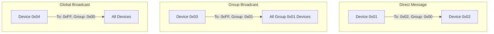

# EventMsg Library

A lightweight event-based messaging protocol library for ESP32 and Arduino platforms. This library provides a reliable communication protocol with features like byte stuffing, message framing, addressing support, and an advanced event dispatcher system.

## Features

- 🔄 Reliable message framing with byte stuffing
- 📫 Advanced dispatcher system with device-based handlers
- 👥 Group-based message filtering
- 🔌 Transport layer agnostic (UART, TCP, BLE, etc.)
- 🛡️ Buffer overflow protection
- 🧩 Event-based architecture with full context support
- 📚 Comprehensive documentation

## Installation

### PlatformIO

1. Add dependency to your `platformio.ini`:

```ini
lib_deps = 
    EventMsg
```

### Manual Installation

1. Download this repository
2. Copy it to your Arduino/libraries folder
3. Restart your Arduino IDE

## Addressing and Message Routing

The EventMsg library uses a flexible addressing system that supports both direct messaging and group-based communication:



### Addressing Modes

1. **Direct Messaging**
   - Set specific receiver address
   - `msg.send("EVENT", "data", 0x02, 0x00, 0x00);  // To device 0x02`

2. **Group Broadcasting**
   - Use broadcast address with group
   - `msg.send("EVENT", "data", 0xFF, 0x01, 0x00);  // To all in group 0x01`

3. **Global Broadcasting**
   - Use broadcast address with no group
   - `msg.send("EVENT", "data", 0xFF, 0x00, 0x00);  // To all devices`

## Performance and Memory Usage

### Static Memory
- Event name buffer: 32 bytes
- Event data buffer: 2048 bytes
- Header buffer: 6 bytes
- Total fixed buffers: ~2.1KB

### Dynamic Memory
- Each dispatcher: ~32 bytes (name + callback)
- Each raw handler: ~32 bytes (name + callback)
- Message processing: No dynamic allocation

### Processing Overhead
- Byte stuffing: 1-2 cycles per byte
- Handler lookup: O(n) where n = number of handlers
- Total overhead: ~10μs per byte on ESP32 @ 240MHz

## Quick Start

### Basic Usage with Event Dispatchers

```cpp
#include <EventMsg.h>

EventMsg eventMsg;

// Handler for mobile app messages with full context
void mobileAppHandler(const char* event, const char* data, uint8_t* header, uint8_t sender, uint8_t receiver) {
    Serial.printf("Mobile App Event: %s, From: 0x%02X\n", event, sender);
    
    if (strcmp(event, "LED_CONTROL") == 0) {
        digitalWrite(LED_BUILTIN, data[0] == '1');
    }
}

// Handler for sensor node messages
void sensorHandler(const char* event, const char* data, uint8_t* header, uint8_t sender, uint8_t receiver) {
    Serial.printf("Sensor Event: %s, From: 0x%02X\n", event, sender);
    
    if (strcmp(event, "TEMP_UPDATE") == 0) {
        // Process temperature data
        float temp = atof(data);
        // Handle temperature reading
    }
}

void setup() {
    Serial.begin(115200);
  
    // Initialize with Serial write callback
    eventMsg.init([](uint8_t* data, size_t len) {
        return Serial.write(data, len) == len;
    });
  
    // Set device address
    eventMsg.setAddr(0x01);
  
    // Register device-specific handlers
    eventMsg.registerDispatcher("mobile_app", 0x01, 0x00, mobileAppHandler);  // Mobile app messages
    eventMsg.registerDispatcher("sensors", 0xFF, 0x00, sensorHandler);        // Sensor broadcasts
}

void loop() {
    // Check for incoming data
    while (Serial.available()) {
        uint8_t byte = Serial.read();
        eventMsg.process(&byte, 1);
    }
  
    // Send temperature reading every second
    static unsigned long lastSend = 0;
    if (millis() - lastSend >= 1000) {
        float temp = readTemperature(); // Your temperature reading function
        char data[32];
        snprintf(data, sizeof(data), "%.1f", temp);
        eventMsg.send("TEMP_UPDATE", data, 0xFF, 0x00, 0x00);  // Broadcast to all sensors
        lastSend = millis();
    }
}
```

### ESP32 BLE Example

See [examples/BLE_ESP32](examples/BLE_ESP32) for a complete BLE communication example that demonstrates using the dispatcher system with both BLE and ESP-NOW communication.

## Protocol Details

The EventMsg protocol uses a simple message format with proper framing:

```
[SOH][Header][STX][Event Name][US][Event Data][EOT]
```

For detailed protocol documentation including message format, control characters, byte stuffing algorithm, and state machine implementation, see [docs/PROTOCOL.md](docs/PROTOCOL.md).

For detailed implementation documentation including core components, memory management, thread safety, and performance optimizations, see [docs/IMPLEMENTATION.md](docs/IMPLEMENTATION.md).

## Development Tools

The library comes with web-based tools to help with development and debugging:

- **Protocol Debugger** ([docs/webtools/protocol-debugger.html](docs/webtools/protocol-debugger.html)) - Interactively explore the protocol structure and decode messages
- **Protocol Editor** ([docs/webtools/protocol-editor.html](docs/webtools/protocol-editor.html)) - Visual tool to create and edit protocol messages
- **BLE Tester** ([docs/webtools/ble-tester.html](docs/webtools/ble-tester.html)) - Test BLE communication using the EventMsg protocol

### Raw Data Handler Usage

```cpp
#include <EventMsg.h>

EventMsg eventMsg;

// Raw handler for binary data
void rawHandler(const char* deviceName, const char* event, uint8_t* data, size_t length) {
    Serial.printf("Raw Event from %s: %s, Length: %d\n", deviceName, event, length);
    // Process binary data directly
    for(size_t i = 0; i < length; i++) {
        Serial.printf("%02X ", data[i]);
    }
    Serial.println();
}

// Unhandled event handler
void unhandledHandler(const char* deviceName, const char* event, uint8_t* data, size_t length) {
    Serial.printf("Unhandled from %s: %s, Length: %d\n", deviceName, event, length);
    // Log or process unhandled events
}

void setup() {
    Serial.begin(115200);
    
    eventMsg.init([](uint8_t* data, size_t len) {
        return Serial.write(data, len) == len;
    });
    
    eventMsg.setAddr(0x01);
    
    // Register raw data handler for binary protocols
    eventMsg.registerRawHandler("binary_handler", 0x02, 0x01, rawHandler);
    
    // Set handler for unmatched events
    eventMsg.setUnhandledHandler("unhandled", 0xFF, 0x00, unhandledHandler);
}

void loop() {
    while (Serial.available()) {
        uint8_t byte = Serial.read();
        eventMsg.process(&byte, 1);
    }
}
```

## API Reference

### Class: EventMsg

#### Methods

##### `bool init(WriteCallback cb)`

Initialize the EventMsg instance with a write callback
- `cb`: Function to handle data transmission
- Returns: `true` if initialization successful

##### `void setAddr(uint8_t addr)`

Set the local device address
- `addr`: Device address (0x00-0xFF)

##### `bool registerDispatcher(const char* deviceName, uint8_t receiverId, uint8_t groupId, EventDispatcherCallback cb)`

Register a device-specific event dispatcher
- `deviceName`: Unique identifier for the device
- `receiverId`: Device address to listen for (0xFF for broadcast)
- `groupId`: Group address to listen for (0x00 for no group)
- `cb`: Callback function `void(const char* deviceName, const char* event, const char* data, uint8_t* header, uint8_t sender, uint8_t receiver)`
- Returns: `true` if registration successful

##### `bool registerRawHandler(const char* deviceName, uint8_t receiverId, uint8_t groupId, RawDataCallback cb)`

Register a raw data handler
- `deviceName`: Unique identifier for the handler
- `receiverId`: Device address to listen for (0xFF for broadcast)
- `groupId`: Group address to listen for (0x00 for no group)
- `cb`: Callback function `void(const char* deviceName, const char* event, uint8_t* data, size_t length)`
- Returns: `true` if registration successful

##### `void setUnhandledHandler(const char* deviceName, uint8_t receiverId, uint8_t groupId, RawDataCallback cb)`

Set handler for unmatched events
- `deviceName`: Unique identifier for the handler
- `receiverId`: Device address to listen for (0xFF for broadcast)
- `groupId`: Group address to listen for (0x00 for no group)
- `cb`: Callback function `void(const char* deviceName, const char* event, uint8_t* data, size_t length)`

Register a device-specific event dispatcher
- `deviceName`: Unique identifier for the device
- `receiverId`: Device address to listen for (0xFF for broadcast)
- `groupId`: Group address to listen for (0x00 for no group)
- `cb`: Callback function `void(const char* event, const char* data, uint8_t* header, uint8_t sender, uint8_t receiver)`
- Returns: `true` if registration successful

##### `bool unregisterDispatcher(const char* deviceName)`

Remove a registered dispatcher
- `deviceName`: Device identifier to remove
- Returns: `true` if dispatcher was found and removed

##### `size_t send(const char* name, const char* data, uint8_t recvAddr, uint8_t groupAddr, uint8_t flags)`

Send an event message
- `name`: Event name string
- `data`: Event data string
- `recvAddr`: Receiver address (0xFF for broadcast)
- `groupAddr`: Group address (0x00 for no group)
- `flags`: Message flags
- Returns: Number of bytes sent, or 0 on failure

##### `bool process(uint8_t* data, size_t len)`

Process received data
- `data`: Pointer to received data
- `len`: Length of received data
- Returns: `true` if valid message was processed

## Limitations

- Maximum event name size: 32 bytes
- Maximum event data size: 2048 bytes
- Maximum header size: 6 bytes
- Maximum number of dispatchers: Limited by available memory

## License

This project is licensed under the MIT License - see the LICENSE file for details.

## Acknowledgments

- Inspired by various messaging protocols and event systems
- Thanks to all contributors and users
