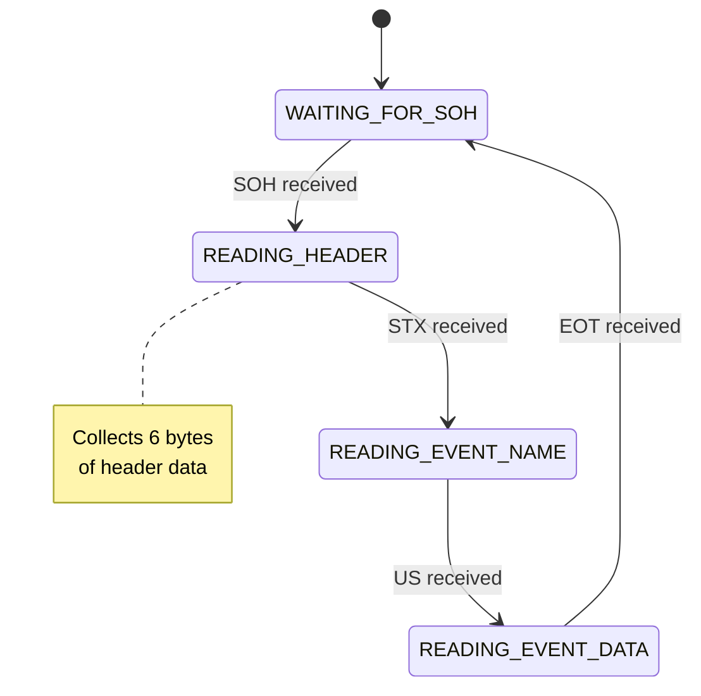
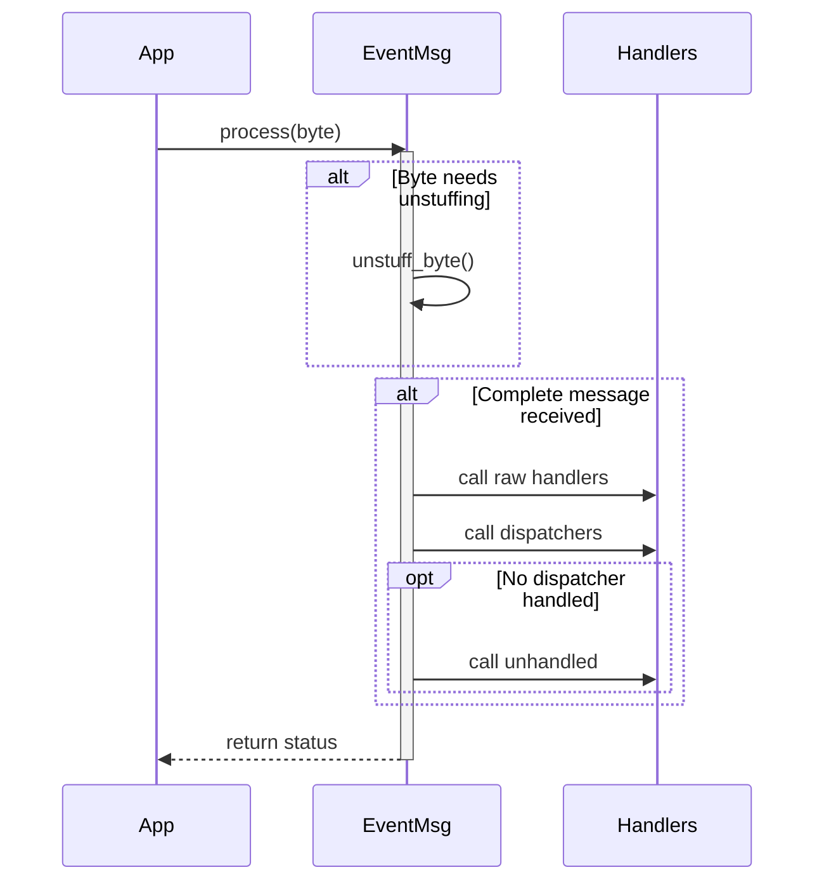

# EventMsg Library Implementation Details

This document describes the internal implementation details of the EventMsg library, useful for contributors and developers wanting to understand or extend the library.

## Core Components

### 1. Message Framing

The library uses a byte-oriented framing system with special control characters:

```cpp
#define SOH 0x01  // Start of Header
#define STX 0x02  // Start of Text
#define US  0x1F  // Unit Separator
#define EOT 0x04  // End of Transmission
#define ESC 0x1B  // Escape Character
```

### 2. Buffer Management

Size constraints are enforced to prevent buffer overflows:

```cpp
#define MAX_HEADER_SIZE    6      // Fixed header size
#define MAX_EVENT_NAME_SIZE 32    // Maximum event name length
#define MAX_EVENT_DATA_SIZE 2048  // Maximum event data length
```

### 3. Byte Stuffing

The byte stuffing algorithm ensures control characters within the message content are properly escaped:

1. **Encoding**:
```cpp
If byte is control character (SOH, STX, US, EOT, ESC):
    Output: ESC
    Output: (byte XOR 0x20)
Else:
    Output: byte as-is
```

2. **Decoding**:
```cpp
If byte is ESC:
    Next byte = (next_byte XOR 0x20)
Else:
    Use byte as-is
```

### 4. Message Structure

#### Header Format
```
Byte 0: Sender Address   (0x00-0xFF)
Byte 1: Receiver Address (0x00-0xFF, 0xFF = broadcast)
Byte 2: Group Address    (0x00-0xFF)
Byte 3: Flags           (User defined)
Byte 4: Message ID High  (Counter MSB)
Byte 5: Message ID Low   (Counter LSB)
```

#### Complete Message
```
[SOH][Stuffed Header][STX][Stuffed Event Name][US][Stuffed Event Data][EOT]
```

## State Machine Implementation

### 1. States



### 2. Processing Flow

```cpp
while (data available) {
    byte = next input byte
    
    if (escaped_mode) {
        process_escaped_byte()
    }
    else if (byte == ESC) {
        escaped_mode = true
    }
    else {
        process_normal_byte()
    }
}
```

## Memory Management

### 1. Static Buffers

The library uses static buffers to avoid heap fragmentation:

```cpp
uint8_t headerBuffer[MAX_HEADER_SIZE];
uint8_t eventNameBuffer[MAX_EVENT_NAME_SIZE];
uint8_t eventDataBuffer[MAX_EVENT_DATA_SIZE];
```

### 2. Buffer Safety

- Size checks before every buffer write
- Clear buffers between messages
- Proper null-termination of strings

## Callback System

### 1. Write Callback

```cpp
using WriteCallback = std::function<bool(uint8_t*, size_t)>;
```

The write callback allows the library to be transport-agnostic. It:
- Returns true if all bytes were written
- Returns false on error
- Is called with stuffed and framed message

### 2. Event Processing Flow



### 3. Memory Footprint Analysis

#### Static Memory Usage
```cpp
class EventMsg {
    uint8_t headerBuffer[6];     // 6 bytes
    uint8_t eventNameBuffer[32]; // 32 bytes
    uint8_t eventDataBuffer[2048]; // 2048 bytes
    // Total fixed buffers: ~2.1KB
};
```

#### Dynamic Memory Usage
```cpp
// Per dispatcher overhead
struct EventDispatcher {
    std::string deviceName;     // ~24 bytes
    uint8_t receiverId;         // 1 byte
    uint8_t groupId;           // 1 byte
    EventDispatcherCallback cb; // ~4-8 bytes
    // Total: ~32 bytes per dispatcher
};

// Per raw handler overhead
struct RawDataHandler {
    std::string deviceName;    // ~24 bytes
    uint8_t receiverId;        // 1 byte
    uint8_t groupId;          // 1 byte
    RawDataCallback cb;       // ~4-8 bytes
    // Total: ~32 bytes per handler
};
```

### 4. Performance Metrics

#### Message Overhead
1. **Byte Stuffing**
   - Best case: No overhead (no control chars)
   - Worst case: 2x size (all chars need stuffing)
   - Typical: ~5-10% overhead

2. **Message Framing**
   - Fixed overhead per message: 4 bytes
   - Header size: 6 bytes
   - Total minimum: 10 bytes + payload

#### Processing Time (ESP32 @ 240MHz)
```
Operation          | Time (μs)
------------------|----------
Byte unstuffing   | 0.5-1.0
Header parsing    | 2-3
Handler lookup    | 1-2 per handler
Dispatcher call   | 3-5
Raw handler call  | 2-4
```

#### Memory Operations
- Zero-copy design for data passing
- Minimal string conversions
- No heap fragmentation
- Buffer reuse between messages

## Threading Considerations

1. The library is not inherently thread-safe
2. Users must provide synchronization if:
   - Calling process() from multiple threads
   - Calling send() from multiple threads
   - Modifying configuration during operation

## Performance Optimizations

1. **Message Building**
   - Pre-allocated buffers
   - Single-pass byte stuffing
   - In-place header construction

2. **Message Processing**
   - Zero-copy where possible
   - Minimal string copying
   - Early filtering of messages

3. **Memory Usage**
   - Static allocation
   - Buffer reuse
   - No dynamic allocation during normal operation

## Error Handling

1. **Buffer Overflows**
   - Size checks before writes
   - Return zero/false on overflow
   - Clear partial message data

2. **Protocol Errors**
   - Invalid sequence detection
   - Timeout handling
   - Malformed message rejection

3. **Debug Output**
   ```cpp
   #define DEBUG_PRINT(msg, ...) \
       do { \
           Serial.printf("[%lu][EventMsg] ", millis()); \
           Serial.printf(msg "\n", ##__VA_ARGS__); \
       } while(0)
   ```

## Testing Strategy

1. **Unit Tests**
   - Buffer management
   - Byte stuffing
   - Message framing
   - Address filtering

2. **Integration Tests**
   - Full message round-trip
   - Multiple connected devices
   - Error conditions

3. **Test Vectors**
   - Basic messages
   - Edge cases
   - Error conditions
   - Maximum size messages

## Future Improvements

1. **Potential Enhancements**
   - CRC/Checksum support
   - Message compression
   - Priority queueing
   - Acknowledge/retry system

2. **Optimization Opportunities**
   - Zero-copy API
   - DMA support
   - Interrupt-driven processing
   - Custom allocator support
