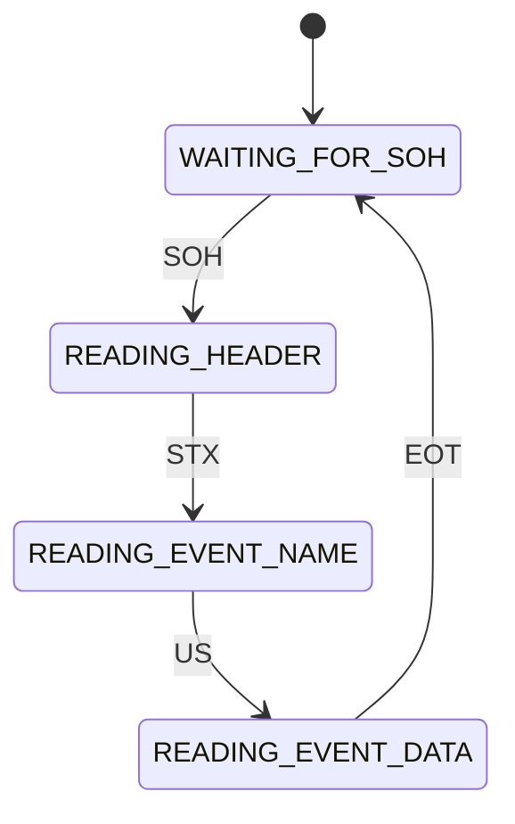

# EventMsg Protocol Documentation

## Overview

EventMsg is a lightweight event-based messaging protocol designed for embedded systems, particularly ESP32 and Arduino platforms. It provides reliable communication with features like byte stuffing, message framing, and addressing.

## Protocol Structure

### Message Format

```
[SOH][Stuffed Header][STX][Stuffed Event Name][US][Stuffed Event Data][EOT]
```

### Control Characters

| Character | Hex Value | Description |
|-----------|-----------|-------------|
| SOH | 0x01 | Start of Header |
| STX | 0x02 | Start of Text |
| US  | 0x1F | Unit Separator |
| EOT | 0x04 | End of Transmission |
| ESC | 0x1B | Escape Character |

### Header Structure (6 bytes)
```
[Sender Address (1B)][Receiver Address (1B)][Group Address (1B)][Flags (1B)][Message ID (2B)]
```

## Implementation Details

### 1. Message Generation

```cpp
Message Structure:
1. Start with SOH
2. Add byte-stuffed header
3. Add STX marker
4. Add byte-stuffed event name
5. Add US separator
6. Add byte-stuffed event data
7. End with EOT
```

### 2. Byte Stuffing Algorithm

Byte stuffing is used to escape control characters within the message:

```cpp
For each byte in data:
    if byte is a control character (SOH, STX, US, EOT, ESC):
        output ESC
        output (byte XOR 0x20)  // Obfuscation
    else:
        output byte as-is
```

### 3. State Machine Decoder

The decoder implements a state machine with the following states:

1. WAITING_FOR_SOH
2. READING_HEADER
3. WAITING_FOR_STX
4. READING_EVENT_NAME
5. WAITING_FOR_US
6. READING_EVENT_DATA
7. WAITING_FOR_EOT



## Best Practices

### Buffer Management
- Implement proper buffer size limits
- Check for buffer overflows
- Clear buffers between messages

### Error Handling
- Implement timeout mechanisms
- Validate message contents
- Handle incomplete messages
- Verify message integrity

### Transport Layer
- Protocol is transport-agnostic
- Can work over UART, TCP, BLE, etc.
- Implement proper error checking for your transport

### Thread Safety
- Ensure thread-safe operation
- Handle concurrent access properly
- Use appropriate synchronization mechanisms

## Implementation Examples

### Basic Send Example

```cpp
// Send a temperature update event
float temp = 25.5;
char data[32];
snprintf(data, sizeof(data), "%.1f", temp);
eventMsg.send("TEMP_UPDATE", data, 0xFF, 0x00, 0x00);
```

### Basic Receive Example

```cpp
// Register event handler
eventMsg.onEvent([](const char* name, const char* data) {
    if (strcmp(name, "TEMP_UPDATE") == 0) {
        float temp = atof(data);
        // Handle temperature update
    }
});
```

## Testing

### Test Vectors
1. Basic message with no byte stuffing
2. Message requiring byte stuffing
3. Empty event data
4. Maximum length messages
5. Invalid message format handling

## Performance Considerations

1. Memory Usage
   - Fixed buffer sizes
   - Static memory allocation
   - Stack usage monitoring

2. Processing Overhead
   - Byte stuffing impact
   - State machine efficiency
   - Buffer copying optimization

## Additional Resources

- [Library Repository](https://github.com/yourusername/EventMsg)
- [API Documentation](../README.md)
- [Example Projects](../examples/)
