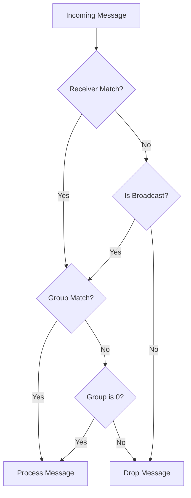
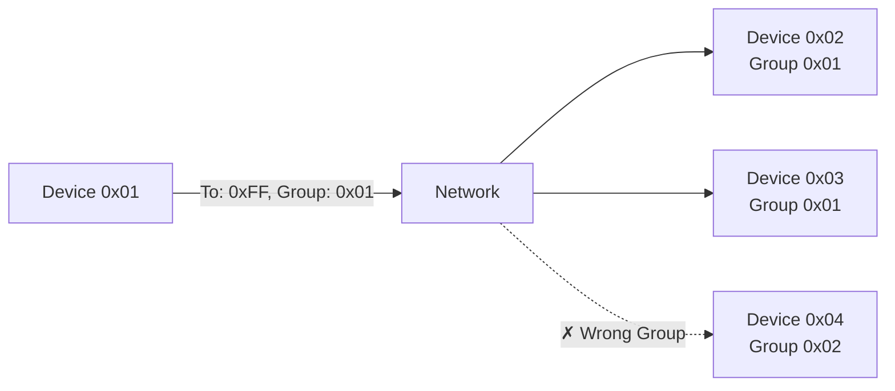
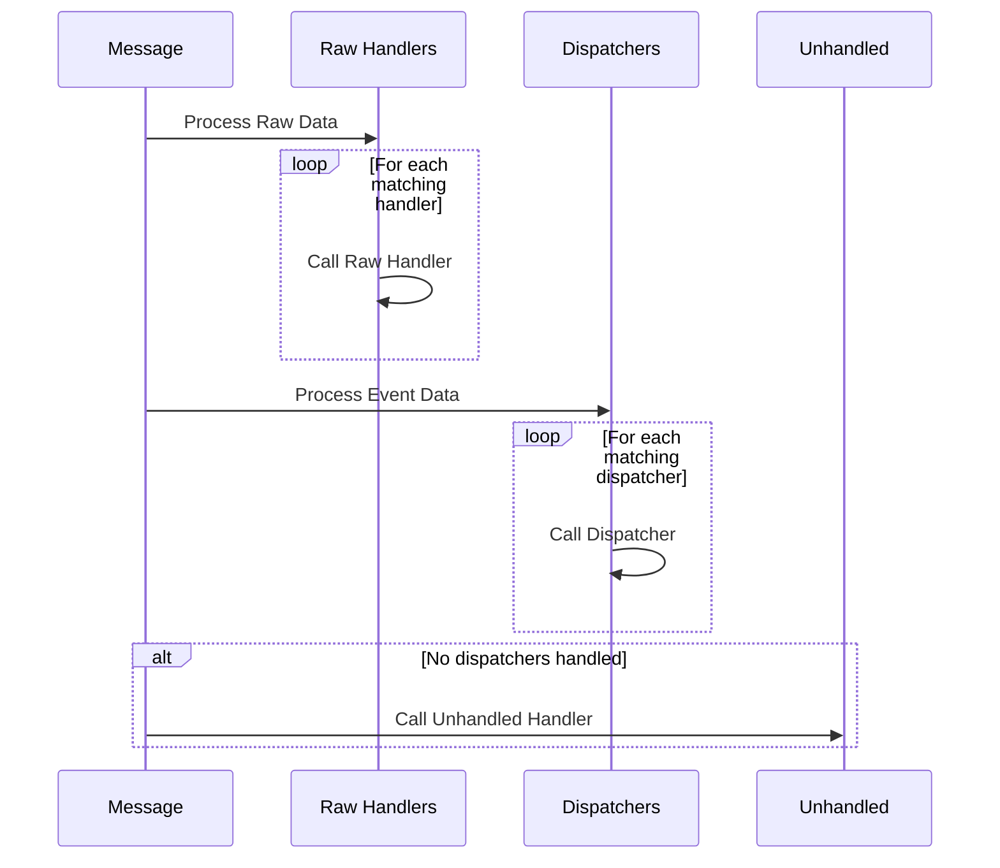
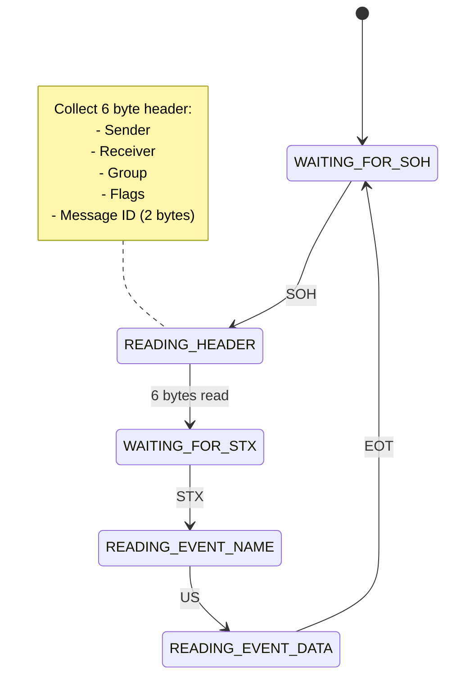

# EventMsg Protocol Specification

## Message Format

The EventMsg protocol uses the following frame format:

```
[SOH][Header][STX][Event Name][US][Event Data][EOT]
```

### Control Characters

- SOH (0x01): Start of Header - Marks beginning of message
- STX (0x02): Start of Text - Marks beginning of event name
- US (0x1F): Unit Separator - Separates event name from data
- EOT (0x04): End of Transmission - Marks end of message
- ESC (0x1B): Escape Character - Used for byte stuffing

### Header Format

The header is now encapsulated in an EventHeader structure for easier management:

```cpp
struct EventHeader {
    uint8_t senderId;    // Source device address
    uint8_t receiverId;  // Destination device address (0xFF for broadcast)
    uint8_t groupId;     // Group identifier (0x00 for no group)
    uint8_t flags;       // Message flags
};
```

When transmitted, the header includes message ID (2 bytes) following this format:
```
[Sender Address][Receiver Address][Group Address][Flags][Message ID MSB][Message ID LSB]
```

Helper functions simplify header creation:
```cpp
// Create header for specific device/group
auto header = EventDispatcher::createHeader(DEVICE01, GROUP00);

// Create response header automatically setting sender/receiver
auto responseHeader = EventDispatcher::createResponseHeader(originalHeader);
```

## Event Handler System

The EventMsg library now provides two ways to handle events:

### 1. Event Dispatcher (New Simplified Interface)
```cpp
// Create dispatcher with local address
EventDispatcher dispatcher(DEVICE01);

// Register event-specific handlers
dispatcher.on("temperature", [](const char* data, const EventHeader& header) {
    float temp = atof(data);
    // Process temperature data
    
    // Send response using helper
    auto responseHeader = EventDispatcher::createResponseHeader(header);
    eventMsg.send("temp_ack", "received", responseHeader);
});

// Register with EventMsg
auto header = EventDispatcher::createHeader(DEVICE01, GROUP00);
eventMsg.registerDispatcher("tempHandler", header, EventDispatcher::handler);
```

Features:
- Event-specific callbacks
- Simplified parameter list
- Automatic header management
- Built-in response helpers
- Type-safe header handling

### 2. Legacy Event Dispatchers
The original dispatcher system remains available for backwards compatibility:
```cpp
void legacyHandler(const char* deviceName, const char* event, const char* data, 
                  uint8_t* header, uint8_t sender, uint8_t receiver) {
    // Legacy handling code
}
eventMsg.registerDispatcher("legacy", receiverId, groupId, legacyHandler);
```

### 3. Raw Data Handlers
- Handlers that receive raw, unprocessed message data
- Each raw handler registers with:
  - Device name (string identifier)
  - Receiver ID (address to listen for)
  - Group ID (group to listen for)
  - Callback function receiving:
    - Device name (string identifier)
    - Event name (string)
    - Raw data buffer (byte array)
    - Data length (size_t)

### 3. Unhandled Event Handler
- Special handler for events not processed by any dispatcher
- Registers like a raw handler with:
  - Device name
  - Receiver ID
  - Group ID
  - Callback for unmatched events

### Message Routing

Messages are routed through a priority-based filtering system, with support for both new and legacy handlers:



1. **Direct Message Routing**


2. **Group Message Routing**


3. **Global Broadcast**


### Handler Execution Sequence



Messages may be processed by multiple handlers if their filters match. The processing sequence is:

1. Raw Data Handlers (can inspect/modify raw data)
2. Event Dispatchers (process formatted string data)
3. Unhandled Event Handler (if no dispatcher handled the event)

## Byte Stuffing

To ensure reliable transmission when control characters appear in the message content, byte stuffing is used:

### Control Character Table
```
Control Char | Hex  | Stuffed Sequence
-------------|------|----------------
SOH          | 0x01 | ESC 0x21
STX          | 0x02 | ESC 0x22
US           | 0x1F | ESC 0x3F
EOT          | 0x04 | ESC 0x24
ESC          | 0x1B | ESC 0x3B
```

### Stuffing Algorithm

1. **When sending:**
   ```cpp
   if (byte is control character) {
       output(ESC);
       output(byte XOR 0x20);
   } else {
       output(byte);
   }
   ```

2. **When receiving:**
   ```cpp
   if (byte == ESC) {
       next_byte = input();
       actual_byte = next_byte XOR 0x20;
   } else {
       actual_byte = byte;
   }
   ```

### Stuffing Example
```
Original:  SOH A B EOT
Hex:       01 41 42 04
Stuffed:   1B 21 41 42 1B 24
           ^^ ^^ -- -- ^^ ^^
           |  |        |  +-- 0x04 XOR 0x20
           |  |        +-- ESC
           |  +-- 0x01 XOR 0x20
           +-- ESC
```

## State Machine

The protocol parser implements a state machine with the following states:



### State Details

1. **WAITING_FOR_SOH**
   - Initial state
   - Wait for Start of Header
   - Reset all buffers

2. **READING_HEADER**
   - Collect 6 bytes
   - Apply byte unstuffing
   - Validate header format

3. **WAITING_FOR_STX**
   - Expect Start of Text
   - Error if not received

4. **READING_EVENT_NAME**
   - Collect event name bytes
   - Apply byte unstuffing
   - Check length limits

5. **READING_EVENT_DATA**
   - Collect event data bytes
   - Apply byte unstuffing
   - Check length limits
   - Process EOT

## Example Message Flow

```
Device A (0x01) sending temperature to Device B (0x02):

[SOH][01 02 00 00 00 01][STX]TEMP_UPDATE[US]25.5[EOT]
 ^    ^ ^  ^  ^  ^  ^    ^      ^        ^    ^   ^
 |    | |  |  |  |  |    |      |        |    |   End
 |    | |  |  |  |  |    |      |        |    Data
 |    | |  |  |  |  |    |      |        Separator
 |    | |  |  |  |  |    |      Event Name
 |    | |  |  |  |  |    Start of Text
 |    | |  |  |  |  Message ID LSB
 |    | |  |  |  Message ID MSB
 |    | |  |  Flags
 |    | |  Group
 |    | Receiver
 |    Sender
 Start
```

## Error Handling

1. **Buffer Overflow**
   - Event name > 32 bytes: Error
   - Event data > 2048 bytes: Error
   - Header incomplete: Error

2. **Protocol Errors**
   - Missing STX after header: Error
   - Missing US between name/data: Error
   - Missing EOT: Error
   - Invalid sequence: Error

3. **Recovery**
   - Reset state machine
   - Clear buffers
   - Resume at next SOH

## Implementation Considerations

1. **Buffer Management**
   - Pre-allocate buffers for header, name, data
   - Clear buffers on reset
   - Use buffer position tracking

2. **Message Processing**
   - Process one byte at a time
   - Maintain state between calls
   - Handle escape sequences efficiently

3. **Dispatcher System**
   - Efficient dispatcher lookup
   - Support multiple matching dispatchers
   - Full message context in callbacks

4. **Message Assembly**
   - Validate all components
   - Apply byte stuffing correctly
   - Check buffer limits
   - Maintain message ID sequence

5. **Thread Safety**
   - Process messages in order
   - Protect shared resources
   - Handle concurrent dispatchers
