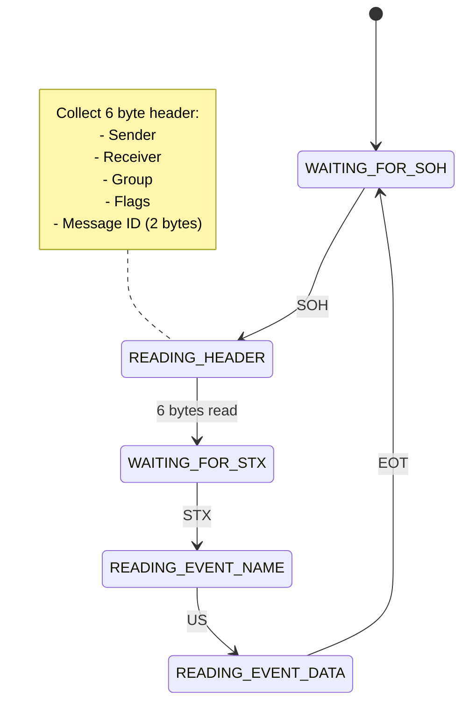

# EventMsg Protocol Specification

## Message Format

The EventMsg protocol uses the following frame format:

```
[SOH][Header][STX][Event Name][US][Event Data][EOT]
```

### Control Characters

- SOH (0x01): Start of Header - Marks beginning of message
- STX (0x02): Start of Text - Marks beginning of event name
- US (0x1F): Unit Separator - Separates event name from data
- EOT (0x04): End of Transmission - Marks end of message
- ESC (0x1B): Escape Character - Used for byte stuffing

### Header Format

6-byte header structure:
```
[Sender Address][Receiver Address][Group Address][Flags][Message ID MSB][Message ID LSB]
```

- **Sender Address** (1 byte): Source device address
- **Receiver Address** (1 byte): Destination device address (0xFF for broadcast)
- **Group Address** (1 byte): Group identifier (0x00 for no group)
- **Flags** (1 byte): Message flags
- **Message ID** (2 bytes): Sequential message identifier (Big-endian)

## Event Dispatcher System

The EventMsg library implements a device-based dispatcher system that routes messages based on receiver and group addresses.

### Dispatcher Registration

Each dispatcher is registered with:
- Device name (string identifier)
- Receiver ID (address to listen for)
- Group ID (group to listen for)
- Callback function receiving:
  - Event name
  - Event data
  - Header buffer
  - Sender address
  - Receiver address

### Message Routing

Messages are routed to dispatchers based on:
1. Exact receiver ID match
2. Broadcast address (0xFF) match
3. Group ID match
4. No group (0x00) match

Multiple dispatchers may receive the same message if their filters match.

## Byte Stuffing

To ensure reliable transmission when control characters appear in the message content, byte stuffing is used:

### Control Character Table
```
Control Char | Hex  | Stuffed Sequence
-------------|------|----------------
SOH          | 0x01 | ESC 0x21
STX          | 0x02 | ESC 0x22
US           | 0x1F | ESC 0x3F
EOT          | 0x04 | ESC 0x24
ESC          | 0x1B | ESC 0x3B
```

### Stuffing Algorithm

1. **When sending:**
   ```cpp
   if (byte is control character) {
       output(ESC);
       output(byte XOR 0x20);
   } else {
       output(byte);
   }
   ```

2. **When receiving:**
   ```cpp
   if (byte == ESC) {
       next_byte = input();
       actual_byte = next_byte XOR 0x20;
   } else {
       actual_byte = byte;
   }
   ```

### Stuffing Example
```
Original:  SOH A B EOT
Hex:       01 41 42 04
Stuffed:   1B 21 41 42 1B 24
           ^^ ^^ -- -- ^^ ^^
           |  |        |  +-- 0x04 XOR 0x20
           |  |        +-- ESC
           |  +-- 0x01 XOR 0x20
           +-- ESC
```

## State Machine

The protocol parser implements a state machine with the following states:



### State Details

1. **WAITING_FOR_SOH**
   - Initial state
   - Wait for Start of Header
   - Reset all buffers

2. **READING_HEADER**
   - Collect 6 bytes
   - Apply byte unstuffing
   - Validate header format

3. **WAITING_FOR_STX**
   - Expect Start of Text
   - Error if not received

4. **READING_EVENT_NAME**
   - Collect event name bytes
   - Apply byte unstuffing
   - Check length limits

5. **READING_EVENT_DATA**
   - Collect event data bytes
   - Apply byte unstuffing
   - Check length limits
   - Process EOT

## Example Message Flow

```
Device A (0x01) sending temperature to Device B (0x02):

[SOH][01 02 00 00 00 01][STX]TEMP_UPDATE[US]25.5[EOT]
 ^    ^ ^  ^  ^  ^  ^    ^      ^        ^    ^   ^
 |    | |  |  |  |  |    |      |        |    |   End
 |    | |  |  |  |  |    |      |        |    Data
 |    | |  |  |  |  |    |      |        Separator
 |    | |  |  |  |  |    |      Event Name
 |    | |  |  |  |  |    Start of Text
 |    | |  |  |  |  Message ID LSB
 |    | |  |  |  Message ID MSB
 |    | |  |  Flags
 |    | |  Group
 |    | Receiver
 |    Sender
 Start
```

## Error Handling

1. **Buffer Overflow**
   - Event name > 32 bytes: Error
   - Event data > 2048 bytes: Error
   - Header incomplete: Error

2. **Protocol Errors**
   - Missing STX after header: Error
   - Missing US between name/data: Error
   - Missing EOT: Error
   - Invalid sequence: Error

3. **Recovery**
   - Reset state machine
   - Clear buffers
   - Resume at next SOH

## Implementation Considerations

1. **Buffer Management**
   - Pre-allocate buffers for header, name, data
   - Clear buffers on reset
   - Use buffer position tracking

2. **Message Processing**
   - Process one byte at a time
   - Maintain state between calls
   - Handle escape sequences efficiently

3. **Dispatcher System**
   - Efficient dispatcher lookup
   - Support multiple matching dispatchers
   - Full message context in callbacks

4. **Message Assembly**
   - Validate all components
   - Apply byte stuffing correctly
   - Check buffer limits
   - Maintain message ID sequence

5. **Thread Safety**
   - Process messages in order
   - Protect shared resources
   - Handle concurrent dispatchers
